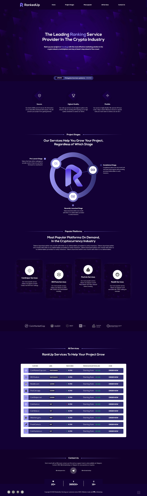

### `RankedUp.io - The Leading Provider in Crypto Industry` [Live Link](https://iftikharrasha.github.io/RankedUp.io/).

<p align="center">
  <a href="https://iftikharrasha.github.io/RankedUp.io/">
    
  </a>
</p>

<h1 align="center">
  Rankedup.io
</h1>
<p align="center">
  Designed using Adobe XD and HTML, JS and SASS for developing the Site.
</p>



## 🚀 Installation

1.  Clone the repository and change directories

    ```shell
    git clone https://github.com/iftikharrasha/RankedUp.io.git
    cd RankedUp.io
    ```

2. Start the local server

    `http://localhost:3000`
    

3.  **Open the source code and start editing!**

 
 ## 🎨 Color Reference
| Color          | Hex                                                                |
| -------------- | ------------------------------------------------------------------ |
| White          |  `#ffffff` |
| Green        |  `#03C952` |
| Red        |  `#E90000` |
| Purple        |  `#9994F0` |
| Lightpurple        |  `#343075` |
| Blue        |  `#130035` |
| Darkblue        |  `#12002A` |
| Black        |  `#000000` |


